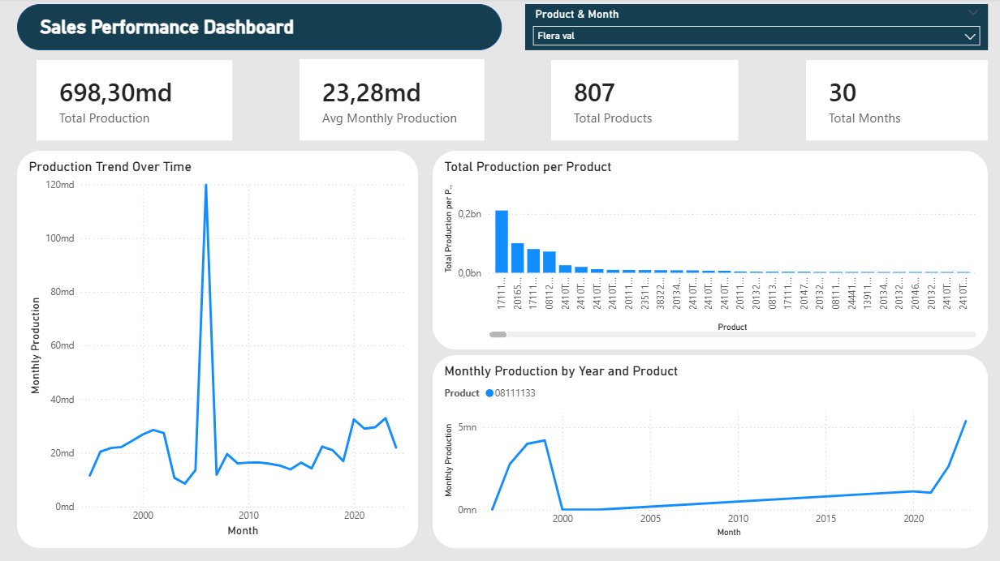
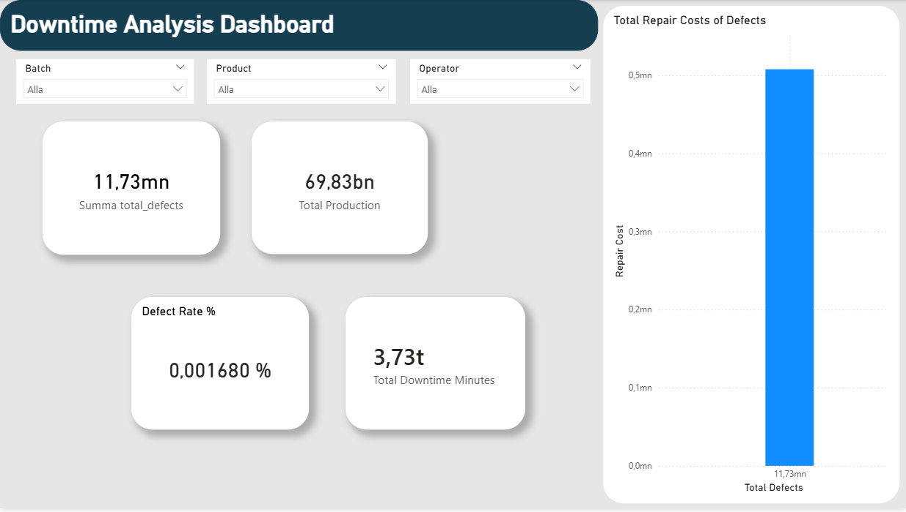
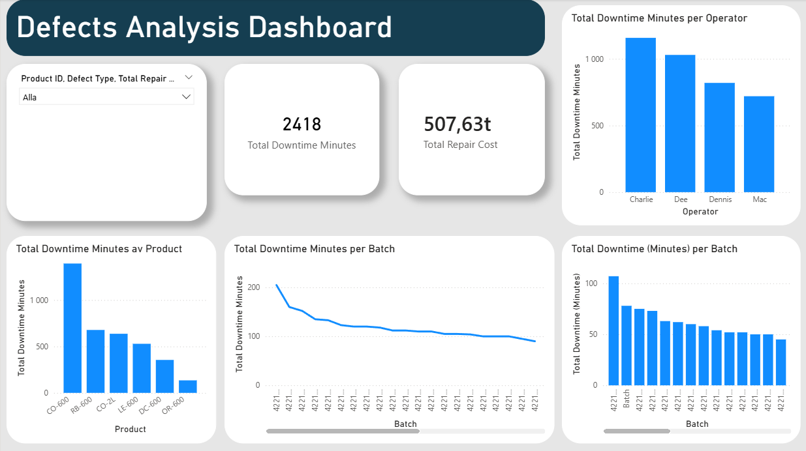

# Production & Downtime Dashboard

This project demonstrates data analysis of production and downtime metrics using **SQL** and **Power BI**.

## Description
- Data collected from production systems
- Downtime and defects analyzed
- KPI dashboards created with interactive slicers

## Screenshots

## Skills Demonstrated
- SQL (data extraction and aggregation)
- Power BI (dashboard, KPI cards, slicers)
